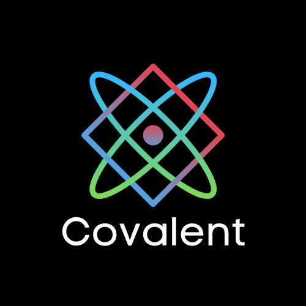

# it will contain a redesign of the AST -> Analyzed AST -> IR -> Backend pipeline

# Covalent
<p align="center">

</p>

WIP DOP Compiled Language, with a cool type system that supports completely optional typing (no need to type even the function arguments) and a dynamic system(avoided as much as possible, may be discarded)

```
covalent path/to/file # builds results in ./ and C code in /tmp/covalent
```

to enter the repl
```
covalent
```
**designed for Linux for now**
**you need gcc installed in path to compile(repl included for now)**

**You only need the covalent exe and libs folder (they should be located in the same folder) libs should contain runtime.o built from src/backend/c/std.c and gc.o, should be automatically built using cargo**

you can compile gc.o from [bdwgc](https://github.com/ivmai/bdwgc) (put it in libs folder) 

# features:
- C backend
- if-else
- while loops
- variables, optional typing with @ `id@type`
- functions, blueprints(some fancy stuff that generates a typed function from a copy of an untyped function on call), and externs
- function and blueprint call `func: args` `argless_func!`
- built-in types: str, int, float, bool, List(T), Dynamic, Back(T) backend version of T, Const(T) C const pointers
- 
- MemberExpr for fields (List(T).size for example), no implantation for member functions yet
- IndexExpr for indexing (List(T)\[index] for example)
- SpecExpr for specifying generics (List(str) for example)

- poor error system
- operators: -, +, *, /, %, &&, ||, ==, >, <, <=, >=

test project in /TestProj, examples in /code(see test project for all features)
